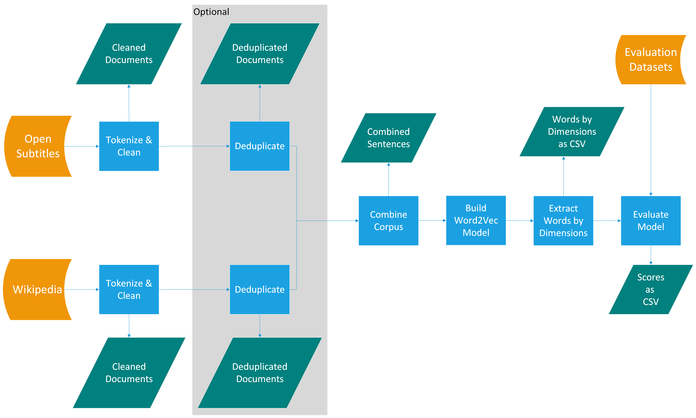

```{r setup, include = FALSE}
library(papaja)
library(trackdown)
library(dplyr)
library(rio)
library(ggplot2)
library(ISOcodes)
library(tidyr)
library(patchwork)

# helper: expand two-letter language codes to names
expand_lang <- function(codes) {
  # keep just the language part if things look like "en-US"
  codes_clean <- sub("^([A-Za-z]{2}).*$", "\\1", codes)
  tibble(code = tolower(codes_clean)) %>%
    left_join(
      ISOcodes::ISO_639_2 |> 
        dplyr::select(Alpha_2, Name) |> 
        dplyr::rename(code = Alpha_2, language = Name),
      by = "code"
    )
}
```

```{r analysis-preferences}
# Seed for random number generation
set.seed(42)
knitr::opts_chunk$set(cache.extra = knitr::rand_seed)
```

```{r trackdown, eval = FALSE}
source("~/GitHub/files/google_creds.R")
# upload_file(
#   file = "manuscript.Rmd",
#   gfile = "words2many_manuscript",
#   hide_code = TRUE
# )

update_file(
  file = "manuscript.Rmd",
  gfile = "words2many_manuscript",
  hide_code = TRUE
)

download_file(
  file = "manuscript.Rmd",
  gfile = "words2many_manuscript",
  hide_code = TRUE
)
```

The scientific study of language, or linguistics, has long sought to uncover the mechanisms and principles underlying human communication. From the early descriptive approaches of Boas [-@handbook2013], first published in 1911, to the generative frameworks introduced in 1957 by Chomsky [@chomsky2002], linguistic theory has aimed to define the structure and function of natural languages. The evolution of the field has paralleled broader developments in cognitive science, computational modeling, and neuropsychology, establishing language as a central topic for interdisciplinary research [@sampson1980, @wilks2006]. In contemporary linguistics, a prominent area of focus lies in the computational modeling of language using large-scale corpora and machine learning techniques. Early efforts focused on machine translation and text analysis [@jones1994], while subsequent developments addressed tasks such as word-sense disambiguation, syntactic parsing, and sentiment analysis [@wilks2006, @medhat2014]. Further computational approaches leverage algorithms to create numerical representations of words, phrases, and sentences, known as word embeddings. Models such as Word2Vec [@mikolov2013] and fastText [@bojanowski2016] exemplify the integration of statistical methods into linguistic research, transforming the study of lexical semantics, syntactic structure, and discourse analysis.

Linguistic data, fundamental to natural language processing research, encompasses diverse forms ranging from raw, unprocessed text to human-provided subjective ratings and computationally enhanced attributes. This data underpins a wide array of tasks, including statistical analyses of word usage, such as lexical diversity measures [@bird2009] and readability prediction [@pitler2008], as well as advanced applications like text generation [@clark2018] and machine translation [@koehn2005]. Moreover, linguistic datasets drive experiments across disciplines, supporting research in neurophysiology [@pereira2018], sociology [@garg2018], and psychology [@vanparidon2021]. The subsequent section will delve into three critical categories of linguistic data: corpora, which provide structured collections of text; objective norms, which quantify measurable linguistic attributes; and subjective norms, which capture human perceptions and evaluations of language.

## Corpora

Corpora, structured collections of text, serve as fundamental resources for linguistic and computational research, enabling systematic analysis of language data [@johansson1998]. A corpus typically consists of tokens—unique instances of word types—that are arranged within a principled format to facilitate linguistic studies [@ogden2013]. These collections may contain raw text, metadata, or annotated linguistic features, providing valuable insights into language usage, syntax, and semantics [@bird2009]. Notable examples include Project Gutenberg, which offers a vast library of public domain texts for statistical analyses, and curated resources like the Brown Corpus, which categorize prose into diverse linguistic domains to support tasks such as frequency estimation and part-of-speech tagging [@kucera1967, @gerlach2020].

Wikipedia, an open-source, community-maintained encyclopedia, has emerged as one of the most extensively used corpora in linguistic research. With over six million articles in English and substantial coverage in other languages, Wikipedia supports a wide range of applications, including information retrieval, ontology development, and natural language processing tasks [@mesgari2015, @medelyan2009]. Its breadth and structured format make it an invaluable resource for creating large-scale language models and analyzing lexical semantics [@vanparidon2021, @mandera2017]. Wikipedia data is refreshed regularly and distributed as compressed XML files, ensuring reproducibility and access to current knowledge repositories.

The OpenSubtitles corpus, comprising over three million subtitles from films and television episodes in more than 60 languages, provides a rich source of pseudo-conversational linguistic data [@lison2016]. Subtitles are particularly valuable for studying spoken-like language, offering insights into lexical frequency, contextual usage, and semantic nuances [@brysbaert2009]. The corpus is periodically updated and distributed in XML format, making it accessible for diverse research applications, including lexical complexity analysis and neural dialog generation [@smolenska2021, @nakamura]. As a multilingual resource, OpenSubtitles has been instrumental in advancing computational models for less-studied languages and cross-linguistic analyses.

## Objective Data

Objective lexical norms capture measurable features of words, such as word length, syllable count, and phonological or orthographic neighborhoods, which are groups of words sharing similar linguistic attributes [@griffiths2015, @marian2017]. These norms are critical for exploring language structure, semantic memory, and bilingual lexical storage [@buchanan2019]. Tools like SUBTLEX-UK calculate frequency-based metrics, demonstrating, for example, that higher-frequency verb conjugations are processed faster than irregular forms [@vanheuven2014, @bowden2010]. While frequency provides a core measure of lexical accessibility, other corpus-derived metrics capture the breadth and variability of word use. Contextual diversity, the number of distinct contexts in which a word appears, often predicts lexical processing as well as or better than frequency [@adelman2006]. Semantic diversity indexes the variability of a word’s usage across contexts and is linked to effects of ambiguity and polysemy [@hoffman2013]. Finally, word length remains a robust factor that interacts with frequency and neighborhood structure [@brysbaert2011].

Phonological and orthographic neighborhoods, which respectively include similar-sounding and visually similar words, play a role in word recognition and production [@vitevitch2016, @buchanan2001]. For instance, words in dense phonological neighborhoods are recognized and produced more efficiently [@marslen-wilson1987, @taler2010]. Likewise, semantic neighborhood density reflects how many words in a semantic space have meanings similar to a given word. Using distributional models such as BEAGLE [@jones2007], researchers can estimate how crowded a word’s "meaning neighborhood" is, providing a meaning-level counterpart to phonological and orthographic neighborhoods and capturing competition or facilitation effects based on semantic similarity [@jones2012]. Normative measurements like word frequency, lexical diversity, and sentence complexity inform linguistic richness and proficiency [@malvern2004]. Combined with metrics such as the Flesch-Kincaid Readability Test, these norms provide valuable insights into vocabulary development and document complexity [@flesch1948]. These objective norms, therefore, serve as foundational tools for studying linguistic phenomena and assessing language proficiency.

## Subjective Data

Subjective lexical norms are derived through human ratings and capture perceptual, emotional, and experiential attributes of words. These norms include age of acquisition, familiarity, imageability, concreteness, valence, and arousal, among others [@buchanan2019]. For instance, age of acquisition measures when a word is typically learned and aids in predicting word recognition times [@kuperman2012, @brysbaert2006]. Familiarity gauges how common a word is within an individual’s experience and often correlates with frequency of exposure, influencing long-term priming effects [@ray2007]. Similarly, imageability captures how easily a word evokes a mental image, significantly impacting word recognition and recall [@boukadi2016]. Concreteness reflects how closely a concept relates to a physical object, with concrete words eliciting faster responses in lexical decision tasks compared to abstract words [@schwanenflugel1991, @barber2013]. Emotional dimensions, such as valence (pleasantness) and arousal (emotional intensity), are integral to affective priming tasks, where response times are influenced by the congruence of priming and target word valence [@fazio1986, @warriner2013].

Databases containing subjective norms, such as the MRC Psycholinguistic Database and the Linguistic Inquiry and Word Count (LIWC) system, integrate both objective and subjective lexical ratings [@wilson1988, @tausczik2010]. These resources enable researchers to study emotional, cognitive, and social aspects of language. For example, LIWC categorizes words into linguistic and emotional categories, such as “anger” or “sadness,” based on iterative human review [@tausczik2010]. Such databases are pivotal for psycholinguistic and computational studies, as they provide standardized measures for analyzing the interplay of lexical properties and human perception. By combining objective measures like frequency and subjective dimensions like valence, these tools offer comprehensive insights into language processing and its cognitive underpinnings.

## Linguistic Modeling

Computational modeling of linguistic data has evolved significantly over the decades, beginning with early approaches such as Latent Semantic Analysis (LSA) in the 1990s. LSA represented words and contexts in a high-dimensional space derived from a co-occurrence matrix, using techniques like Singular Value Decomposition to reduce dimensionality and emphasize meaningful relationships between words [@landauer1997]. These foundational methods introduced the concept of vectorizing language for analysis, enabling researchers to explore semantic relationships through spatial proximity in vector space [@schütze1992, @sahlgren2006]. However, these early models, often called “bag-of-words” approaches, treated words as discrete entities, overlooking word order and internal word structures, which limited their ability to capture nuanced linguistic patterns [@mikolov2013].

The introduction of neural network-based methods in the 2010s marked a turning point in computational linguistics. Mikolov et al. [-@mikolov2013] developed word2vec, which utilized two novel algorithms—Skip-Gram (SG) and Continuous Bag of Words (CBOW)—to predict word context and improve upon earlier models’ efficiency and scalability. These innovations allowed for the creation of embeddings from datasets containing billions of words, with enhanced representation in higher-dimensional spaces. Building on this foundation, Bojanowski et al. [-@bojanowski2016] introduced fastText, incorporating subword information to represent internal word structures, enabling the handling of out-of-vocabulary tokens. The development of these models, along with frameworks like *gensim* [@rehurek2010], consolidated disparate techniques into accessible software packages, making computational modeling of language more efficient and widely applicable. These advancements have paved the way for analyzing large-scale corpora and predicting complex linguistic and cognitive norms, revolutionizing natural language processing and related fields.

## subs2vec

van Paridon and Thompson [-@vanparidon2021] developed word embedding models derived from spoken language across multiple languages, utilizing the OpenSubtitles corpus [@lison2016] and the fastText implementation of word2vec. Their work emphasized the importance of spoken language corpora, which better approximate language acquisition and usage compared to written text, addressing a limitation of prior studies that predominantly relied on Wikipedia-based corpora [@al-rfou]. Models of combined resources were found to predict subjective norm ratings across multiple languages, such as concreteness, valence, and arousal, suggesting that complementary resources are useful for modeling linguistic data.

The models developed by van Paridon and Thompson were constructed using data from 55 languages with uniform parameters across all corpora, regardless of size or linguistic structure. While this consistency aids in cross-linguistic comparisons, other research suggests that model performance can vary significantly based on parameter optimization. For instance, Mandera et al. [-@mandera2017] demonstrated that the choice of parameters, such as vector dimensionality and window size, affects the quality of word embeddings, with optimal settings differing between languages. Their findings highlight that English embeddings performed best with 300 dimensions and a window size of six, whereas Dutch embeddings achieved superior results with 200 dimensions and a window size of ten. These results challenge the assumption that a uniform parameter set is equally effective across languages, given the structural and typological diversity of linguistic systems. This research considers the necessity of tailoring model parameters to individual language characteristics and research goals to enhance the accuracy and applicability of multilingual word embeddings.

## The Current Study

To examine the implicit assumption that all languages can be effectively represented using identical word embedding model parameters, we will construct matrices across a range of parameter combinations, including vector dimensions (50, 100, 200, 300, 500), window sizes (1, 2, 3, 4, 5, 6), and embedding algorithms (Continuous Bag of Words [CBOW] and Skip-Gram). The selected dimensional values reflect those commonly utilized in linguistic studies, as highlighted by Mandera et al. [-@mandera2017]. Window sizes were constrained to a maximum of six based on preliminary experimentation, which indicated that larger window sizes yielded negligible differences in predictive performance.

Unlike prior studies that imposed limitations on corpus size, such as Al-Rfou et al. [-@al-rfou], who restricted corpora to 10,000 words, and van Paridon and Thompson [-@vanparidon2021], who used corpora capped at 1 million words, our models will not limit corpus size. We will evaluate these models by testing their ability to predict:

1)  a direct replication of the same norms used in van Paridon and Thompson,
2)  objective normed data via word frequencies available for all languages
3)  extension to subjective normed data available in more languages than present in the previous investigation

This approach will identify the optimal combination of parameters for each language, providing insights into how embedding models should be tailored for future cross-linguistic studies.

# Method

## Technical Implementation

The fastText model [@bojanowski2016] from the *genism* version 3.8.3 Python package [@rehurek2010] was used to generate the embeddings from the concatenated corpus files (described below). We varied the dimension (50, 100, 200, 300, 500), window size (1, 2, 3, 4, 5, 6), and algorithm parameters to the model (SG: SkipGram, CBOW: Continuous Bag of Words), while holding the remaining parameters constant. The dimensions, window size, and algorithm were chosen as the parameters of interest based on previous research showing they varied between datasets [@mandera2017; @mikolov2013; @bojanowski2016].

These parameter variations resulted in 60 possible combinations per language. Remaining parameter settings were matched to those used in the subs2vec experiment: 1) minimum word count: 5, 2) minimum length of subword ngram: 3, 3) maximum length of subword ngram: 6, 4) sampling threshold: .0001, 5) learning rate: .05, 6) rate of updating the learning rate: 100, 7) epochs: 10, 8) number of negatives sampled in the loss function: 10.

Figure \@ref(fig:tech-details) outlines the workflow for data acquisition, text preprocessing, corpus creation, and the generation of word-by-dimension matrices for each parameter combination. These procedures build on the original Python code from the subs2vec paper, with modifications tailored to the needs of this experiment. The full source code is available at <https://github.com/SemanticPriming/word2manylanguages>, and a working example of the pipeline can be found at XXCODE OCEAN HEREXX.

```{r tech-details, fig.cap="Flow chart representation of data processing, model creation, and prediction for this study.", out.width="100"}

```

### Data Acquisition

This experiment used datasets in 59 languages for which evaluation data were available. The language set includes those from the van Paridon and Thompson study, along with Japanese, Thai, Mandarin, and Cantonese. A full list of languages, along with unique sentence and token counts, is provided in Appendix A. Corpora were built from Wikipedia and OpenSubtitles archives. Open Subtitles files were downloaded from the URL <http://opus.nlpl.eu/download.php?f=OpenSubtitles/v2018/raw/%7Blanguage%7D.zip>, substituting the ISO3166 country code for {language}. The OpenSubtitles archive has updated since original download, but a working example of the file download is provided on the CODE OCEAN page. The OpenSubtitles files contain XML-formatted files for each movie or episode subdivided by year. The movie/episode names are not included in the data, and the order of the sentences is randomized to avoid copyright violation. Wikipedia is organized by language, with each language’s content compiled into a single XML file containing article text and metadata. Wikipedia dump files were downloaded from <http://dumps.wikimedia.your.org/%7Blanguage%7Dwiki/latest/%7Blanguage%7Dwiki-latest-pages-meta-current.xml.bz2>, where {language} is the ISO 3166 code (e.g., en for English, de for German). The download dates for each archive are listed in Appendix A.

### Data Processing

The downloaded data included markup in eXtensible Markup Language (XML), which was removed prior to corpus creation. Markup tokens do not reflect natural language content and can distort frequency counts [@bird2009]. We used regular expressions to strip out markup elements such as tags, punctuation (parentheses, hyphens, apostrophes, slashes, etc.), links, and extraneous whitespace. For Wikipedia data specifically, additional elements like category labels, references, tables, and image tags were also removed. All text was lowercased to normalize the data.

van Paridon and Thompson [-@vanparidon2021] applied sentence-level deduplication within each subtitle and Wikipedia document to reduce the influence of commonly repeated phrases. In contrast, we chose to retain these frequent phrases—such as "Thank you" because of their prevalence in spoken language, which we consider relevant to our analysis. We did apply document-level deduplication to avoid including exact duplicates, though given the curated nature of our data sources, the likelihood of such duplication was low. One corpus file was produced per language, with each file containing one sentence per line.

## Data Analysis

The word embeddings generated during model training were evaluated based on their ability to predict psycholinguistic variables relevant to our research questions. For the direct replication (Research Question 1), we used the same norm datasets employed by @vanparidon2021. To enable evaluation across all languages, we also included word frequency prediction for Research Question 2 [see @brysbaert2009]. Finally, we extended the analysis to additional normed datasets not used in the original study. These included a representative set of subjective norms: age of acquisition, valence, arousal, concreteness, and familiarity, selected for their widespread use in psycholinguistic research [@alario1999].

We used 10-fold ridge regression (*k* = 10) to predict norm values from the embeddings. Ridge regression was chosen due to its effectiveness in mitigating multicollinearity which is a common issue in word embedding models [@kaveh-yazdy], and its demonstrated ability to improve mean squared error performance in this context [@yeh2020]. This approach follows the evaluation procedure used in the original subs2vec study. The ridge regression alpha parameter, which controls the regularization strength, was set to the default value of 1 to balance bias and variance, consistent with prior work.

For each norm prediction task, we selected the simplest model whose $R^2$ value fell within 1% of the best-performing model. Simplicity was defined by the fewest embedding dimensions and the smallest window size. The adjusted $R^2$ value accounts for out-of-vocabulary coverage by multiplying the $R^2$ by the proportion of test words present in the embedding matrix. All model outputs are available in the supplemental materials. Given the volume of results, we developed a Shiny application [@chang2021] to help researchers explore and select optimal models for specific languages and variables of interest.

# Results

## Research Question 1

For the first set of evaluations, each language model was tested using the same normed datasets @vanparidon2021 (see Appendix B for the full list). We applied the same analysis approach as the original study which was ridge regression using the model's output vectors to predict norm values for matched tokens, as detailed in the data analysis section. Because all tables are very large, we recommend examining prediction for specific language, algorithm, and dataset combinations on our online resources or shiny application. The heatmaps shown in Figure \@ref(fig:r1-fig) visualize the top three performing models for each algorithm. For CBOW, there is a clear trend favoring simpler models, with the most frequent configuration being 50 dimensions and a window size of 1. In contrast, the Skip-Gram results show a more balanced spread across dimensionalities, though still skewed toward smaller window sizes, most commonly size 3 or smaller. These results indicate that the parameter settings used in the original fastText models (300 dimensions, window size of 5) are unlikely to be optimal across languages. Notably, those original settings do not appear in the top three results for any language or prediction task under Research Question 1.

```{r r1-fig, fig.cap="Heatmaps showing the number of languages achieving their best performance for each combination of embedding dimension (x-axis) and context window size (y-axis) for the CBOW (left) and skip-gram (right) algorithms. For CBOW, optimal configurations are concentrated at lower dimensions and smaller window sizes, whereas skip-gram tends to favor higher dimensions and moderately larger windows. Numbers inside tiles indicate the count of languages for that parameter combination."}
# heat map 
df1.both <- import("../../data/formatted_data/rep_evals_formatted.csv") %>% 
  group_by(language, algo) %>% 
  arrange(desc(`adjusted r-squared`)) %>% 
  slice_head(n = 3)

# Get all possible dim-window combos
dims <- sort(unique(df1.both$dim))
wins <- sort(unique(df1.both$window))

cbow.grid <- df1.both %>%
  filter(algo == "cbow") %>% 
  distinct(language, dim, window) %>%
  group_by(dim, window) %>%
  summarise(n = n_distinct(language), .groups = "drop") %>%
  complete(dim = dims, window = wins, fill = list(n = 0)) %>%  # fill missing with 0
  mutate(
    dim    = factor(dim,    levels = dims),
    window = factor(window, levels = wins)
  )

cbow.fig1 <- 
  ggplot(cbow.grid, aes(x = dim, y = window, fill = n)) +
  geom_tile(color = "grey60") +
  geom_text(aes(label = n), 
            color = "black",
            size = 5, fontface = "bold") +
  scale_fill_viridis_c(option = "C", begin = 0.05, end = 0.95) +
  coord_fixed() +
  labs(x = "Dimension", y = "Window") + 
  theme_minimal(base_size = 12) +
  theme(panel.grid = element_blank(), legend.position = "none") + 
  ggtitle("CBOW")

sg.grid <- df1.both %>%
  filter(algo == "sg") %>% 
  distinct(language, dim, window) %>%
  group_by(dim, window) %>%
  summarise(n = n_distinct(language), .groups = "drop") %>%
  complete(dim = dims, window = wins, fill = list(n = 0)) %>%  # fill missing with 0
  mutate(
    dim    = factor(dim,    levels = dims),
    window = factor(window, levels = wins)
  ) 

sg.fig1 <- 
  ggplot(sg.grid, aes(x = dim, y = window, fill = n)) +
  geom_tile(color = "grey60") +
  geom_text(aes(label = n), 
            color = "black", 
            size = 5, fontface = "bold") +
  scale_fill_viridis_c(option = "C", begin = 0.05, end = 0.95) +
  coord_fixed() +
  labs(x = "Dimension", y = "Window") + 
  theme_minimal(base_size = 12) +
  theme(panel.grid = element_blank(), legend.position = "none") + 
  ggtitle("SKIP-GRAM")

cbow.fig1 + sg.fig1
```

## Research Question 2

The second set of tests addressed a key limitation: the lack of normed datasets for many of the languages modeled in this and previous studies. While prior work did not evaluate all available languages, word frequency was available for all models, and word frequency is known to correlate with numerous linguistic phenomena [@brysbaert2009]. Unigram (i.e., single-token) frequency counts were directly extracted from the same corpora used to train the embeddings. However, this frequency data initially posed challenges: it included ligatures and diacritics that did not align with the normalized forms in the word-by-dimension matrices. To address this, we applied Unicode normalization and case folding, a standard approach for harmonizing case and character representation in internationalized text. Despite these steps, a substantial number of words remained unmatched, primarily due to the minimum frequency threshold of five tokens in the word embeddings, in contrast to no such threshold in the raw unigram frequency data.

To evaluate performance, frequency data from Wikipedia and OpenSubtitles were analyzed separately, using the combined models built for this study. Full results can be found online and on our interactive shiny application. Note that negative $R^2$ values indicate a penalty for the model failing to represent words found in the frequency data but missing from the vector space. Overall, unigram frequencies proved more difficult to predict from word embeddings than normed psycholinguistic variables. This pattern may reflect the known challenges of estimating lexical properties from decontextualized representations, where static embeddings carry far less explanatory power than context-aware models [@ethayarajh]. These limitations likely contributed to lower predictive performance, with substantial variation across languages.

Figures \@ref(fig:r2-fig1) and \@ref(fig:r2-fig2) display the top-performing models for predicting frequencies, separated by algorithm. As in the norm prediction tasks, simpler models again dominated. CBOW strongly favored the combination of 50 dimensions and a window size of 1. Skip-gram results were more varied but still leaned toward lower dimensionalities and small window sizes. Interestingly, differences in predictive performance between Wikipedia and OpenSubtitles suggest that dataset type matters. While @vanparidon2021 showed that combining formal (Wikipedia) and informal (OpenSubtitles) corpora can improve overall model performance, our findings suggest that matching the style of the model's training data to the test data may be even more effective if practical. These results raise the possibility that corpus-specific models may outperform general-purpose models for certain applications.

```{r r2-fig1, fig.cap = "Heatmaps showing the number of languages for which each combination of embedding dimension (x-axis) and context window size (y-axis) yielded the best predictive performance for subtitle-based word frequency norms. Numbers within tiles indicate the count of languages achieving the top 3 highest prediction for that parameter combination."}
# heat map 
df2.both <- import("../../data/formatted_data/count_evals_formatted.csv") %>% 
  filter(data_source == "Subtitles") %>% 
  group_by(language, algo) %>% 
  arrange(desc(`adjusted r-squared`)) %>% 
  slice_head(n = 3)

# Get all possible dim-window combos
dims <- sort(unique(df2.both$dim))
wins <- sort(unique(df2.both$window))

cbow.grid <- df2.both %>%
  filter(algo == "cbow") %>% 
  distinct(language, dim, window) %>%
  group_by(dim, window) %>%
  summarise(n = n_distinct(language), .groups = "drop") %>%
  complete(dim = dims, window = wins, fill = list(n = 0)) %>%  # fill missing with 0
  mutate(
    dim    = factor(dim,    levels = dims),
    window = factor(window, levels = wins)
  )

cbow.fig2 <- 
  ggplot(cbow.grid, aes(x = dim, y = window, fill = n)) +
  geom_tile(color = "grey60") +
  geom_text(aes(label = n), 
            color = "black",
            size = 5, fontface = "bold") +
  scale_fill_viridis_c(option = "C", begin = 0.05, end = 0.95) +
  coord_fixed() +
  labs(x = "Dimension", y = "Window") + 
  theme_minimal(base_size = 12) +
  theme(panel.grid = element_blank(), legend.position = "none") + 
  ggtitle("CBOW")

sg.grid <- df2.both %>%
  filter(algo == "sg") %>% 
  distinct(language, dim, window) %>%
  group_by(dim, window) %>%
  summarise(n = n_distinct(language), .groups = "drop") %>%
  complete(dim = dims, window = wins, fill = list(n = 0)) %>%  # fill missing with 0
  mutate(
    dim    = factor(dim,    levels = dims),
    window = factor(window, levels = wins)
  ) 

sg.fig2 <- 
  ggplot(sg.grid, aes(x = dim, y = window, fill = n)) +
  geom_tile(color = "grey60") +
  geom_text(aes(label = n), 
            color = "black", 
            size = 5, fontface = "bold") +
  scale_fill_viridis_c(option = "C", begin = 0.05, end = 0.95) +
  coord_fixed() +
  labs(x = "Dimension", y = "Window") + 
  theme_minimal(base_size = 12) +
  theme(panel.grid = element_blank(), legend.position = "none") + 
  ggtitle("SKIP-GRAM")

cbow.fig2 + sg.fig2
```

```{r r2-fig2, fig.cap= "Heatmaps showing the number of languages for which each combination of embedding dimension (x-axis) and context window size (y-axis) produced the top three highest adjusted $R^2$ when predicting Wikipedia-based word frequency norms."}
# heat map 
df2.both <- import("../../data/formatted_data/count_evals_formatted.csv") %>% 
  filter(data_source == "Wikipedia") %>% 
  group_by(language, algo) %>% 
  arrange(desc(`adjusted r-squared`)) %>% 
  slice_head(n = 3)

# Get all possible dim-window combos
dims <- sort(unique(df2.both$dim))
wins <- sort(unique(df2.both$window))

cbow.grid <- df2.both %>%
  filter(algo == "cbow") %>% 
  distinct(language, dim, window) %>%
  group_by(dim, window) %>%
  summarise(n = n_distinct(language), .groups = "drop") %>%
  complete(dim = dims, window = wins, fill = list(n = 0)) %>%  # fill missing with 0
  mutate(
    dim    = factor(dim,    levels = dims),
    window = factor(window, levels = wins)
  )

cbow.fig3 <- 
  ggplot(cbow.grid, aes(x = dim, y = window, fill = n)) +
  geom_tile(color = "grey60") +
  geom_text(aes(label = n), 
            color = "black",
            size = 5, fontface = "bold") +
  scale_fill_viridis_c(option = "C", begin = 0.05, end = 0.95) +
  coord_fixed() +
  labs(x = "Dimension", y = "Window") + 
  theme_minimal(base_size = 12) +
  theme(panel.grid = element_blank(), legend.position = "none") + 
  ggtitle("CBOW")

sg.grid <- df2.both %>%
  filter(algo == "sg") %>% 
  distinct(language, dim, window) %>%
  group_by(dim, window) %>%
  summarise(n = n_distinct(language), .groups = "drop") %>%
  complete(dim = dims, window = wins, fill = list(n = 0)) %>%  # fill missing with 0
  mutate(
    dim    = factor(dim,    levels = dims),
    window = factor(window, levels = wins)
  ) 

sg.fig3 <- 
  ggplot(sg.grid, aes(x = dim, y = window, fill = n)) +
  geom_tile(color = "grey60") +
  geom_text(aes(label = n), 
            color = "black", 
            size = 5, fontface = "bold") +
  scale_fill_viridis_c(option = "C", begin = 0.05, end = 0.95) +
  coord_fixed() +
  labs(x = "Dimension", y = "Window") + 
  theme_minimal(base_size = 12) +
  theme(panel.grid = element_blank(), legend.position = "none") + 
  ggtitle("SKIP-GRAM")

cbow.fig3 + sg.fig3
```

## Research Question 3

The third set of evaluations used datasets from the Linguistic Annotated Bibliography [@buchanan2019], which contain normed psycholinguistic data similar to those used in the replication set, but cover a broader range of languages and norm types. A full overview of these datasets is provided in our online materials and shiny application. As with previous tests, the results show substantial variation across languages, reinforcing the conclusion that no single parameter configuration performs best across all contexts. The heatmaps in Figure \@ref(fig:r3-fig), separated by algorithm, reflect patterns similar to those observed in the replication analysis. CBOW models again favored simpler configurations, though the most common cluster shifted to 100 dimensions (compared to 50 in the earlier CBOW results). Skip-gram models remained more distributed, with a consistent preference for smaller window sizes but somewhat higher dimensionalities overall.

```{r r3-fig, fig.cap="Heatmaps showing the number of languages for which each combination of embedding dimension (x-axis) and context window size (y-axis) produced the top three predictive values when predicting across an extended set of avaliable norms."}
# heat map 
df3.both <- import("../../data/formatted_data/extension_evals_formatted.csv") %>% 
  group_by(language, algo) %>% 
  arrange(desc(`adjusted r-squared`)) %>% 
  slice_head(n = 3)

# Get all possible dim-window combos
dims <- sort(unique(df3.both$dim))
wins <- sort(unique(df3.both$window))

cbow.grid <- df3.both %>%
  filter(algo == "cbow") %>% 
  distinct(language, dim, window) %>%
  group_by(dim, window) %>%
  summarise(n = n_distinct(language), .groups = "drop") %>%
  complete(dim = dims, window = wins, fill = list(n = 0)) %>%  # fill missing with 0
  mutate(
    dim    = factor(dim,    levels = dims),
    window = factor(window, levels = wins)
  )

cbow.fig4 <- 
  ggplot(cbow.grid, aes(x = dim, y = window, fill = n)) +
  geom_tile(color = "grey60") +
  geom_text(aes(label = n), 
            color = "black",
            size = 5, fontface = "bold") +
  scale_fill_viridis_c(option = "C", begin = 0.05, end = 0.95) +
  coord_fixed() +
  labs(x = "Dimension", y = "Window") + 
  theme_minimal(base_size = 12) +
  theme(panel.grid = element_blank(), legend.position = "none") + 
  ggtitle("CBOW")

sg.grid <- df3.both %>%
  filter(algo == "sg") %>% 
  distinct(language, dim, window) %>%
  group_by(dim, window) %>%
  summarise(n = n_distinct(language), .groups = "drop") %>%
  complete(dim = dims, window = wins, fill = list(n = 0)) %>%  # fill missing with 0
  mutate(
    dim    = factor(dim,    levels = dims),
    window = factor(window, levels = wins)
  ) 

sg.fig4 <- 
  ggplot(sg.grid, aes(x = dim, y = window, fill = n)) +
  geom_tile(color = "grey60") +
  geom_text(aes(label = n), 
            color = "black", 
            size = 5, fontface = "bold") +
  scale_fill_viridis_c(option = "C", begin = 0.05, end = 0.95) +
  coord_fixed() +
  labs(x = "Dimension", y = "Window") + 
  theme_minimal(base_size = 12) +
  theme(panel.grid = element_blank(), legend.position = "none") + 
  ggtitle("SKIP-GRAM")

cbow.fig4 + sg.fig4
```

# Discussion

This experiment demonstrates that the structure and parameterization of word embedding models significantly impact their performance, and that these effects vary across languages and tasks. While @vanparidon2021 showed that combining formal and informal language sources (Wikipedia and OpenSubtitles) improves predictive accuracy over models trained on Wikipedia alone, our findings go further: even with the same training data, the optimal embedding parameters, such as vector dimensionality and window size, differ markedly across languages and tasks. This finding reinforces the importance of customizing model configurations rather than relying on default or pre-trained settings.

Despite the rise of transformer-based models, recent studies have shown that classic word embedding approaches such as fastText remain competitive and in some cases outperform deep learning models on specific tasks [@wang2020]. These classic models are more interpretable, computationally efficient, and resource-accessible, making them ideal for researchers without access to extensive compute infrastructure. To support the broader research community, we have made available the full set of models and evaluation results from this study, along with open-source code for training and evaluating embeddings across languages and tasks. These materials will be particularly valuable for researchers working with lower-resource languages, or those conducting multilingual studies where model retraining from scratch may be impractical.

Across all three sets of evaluations, norm prediction replication, frequency prediction, and extended norm prediction using the Linguistic Annotated Bibliography datasets, our results consistently show wide variation in optimal parameters. These results answer our first research question: no single configuration generalizes well across languages. This result is consistent with linguistic theory. Languages differ not only in script and morphology, but also in typological features such as word order, determiners, affixation, and compounding [@wals-81]. These differences shape token distributions and word co-occurrence patterns, which are central to embedding learning. Additionally, corpus size and the lexical diversity of the source text contribute to how embeddings are learned, especially in low-resource or morphologically rich languages [@vania].

Our shiny application allows researchers to review the optimal parameter settings for each language and task. Even within a single language, the best settings for predicting word frequency in formal (Wikipedia) versus informal (OpenSubtitles) data diverged. Likewise, different psycholinguistic variables, such as valence, age of acquisition, and imageability, were best predicted by models with different configurations. This finding supports the view that parameter tuning should be context-dependent, aligned with both the source of the input data and the nature of the variable to be predicted. For example, emotional valence may be more prevalent in informal speech, while age of acquisition norms may be better reflected in formal, education-linked text.

Given the widespread use of word embeddings across psycholinguistics, natural language processing, and cross-linguistic studies, this variability has important implications. Many studies rely on pre-trained embeddings (e.g., from fastText or BERT) assuming they are broadly applicable. Our findings suggest caution in this approach. Researchers should consider re-training or fine-tuning embeddings using representative data and tuning parameters for their specific application. More systematic evaluation across languages, tasks, and variable types is needed to better understand these dependencies.

## Limitations

While this study extended prior work by building and testing word embedding models for 59 languages, we were limited by the availability of validated norm datasets. Norms are difficult to obtain for many languages, especially those with fewer computational and psycholinguistic resources. Language resources are frequently published in journals like *Behavior Research Methods* and *Language Resources and Evaluation* and should continue to evolved with increased computational power. New big team science initiatives, such as the ManyLanguages collaboration [@manylang], can improve the availability and diversity of languages published for research use.

Another key limitation is that our evaluation was task-specific. While we tested prediction of norm variables and frequency data, other important tasks (e.g., analogy solving, named entity recognition, semantic similarity judgments) may yield different optimal configurations. Thus, while our models provide strong baselines for norm-based prediction, further tuning may be required for other applications. Finally, we were unable to identify consistent patterns linking optimal parameters to geographic proximity or language families (Research Question 3). While this may reflect the complex, multidimensional nature of linguistic structure and usage, it also suggests the need for deeper investigation, potentially incorporating sociolinguistic and typological data to uncover more subtle patterns.

## Future Work

One promising direction for future research is to explore variation within languages, particularly across dialects. While this study included multiple dialects of Chinese (e.g., Mandarin and Cantonese), only one variant was used for most other languages, such as English, Spanish, and Portuguese. Previous research has shown that dialectal variation can significantly affect lexical choice, syntax, and even semantic interpretation [@blodgett; @joshi2025], suggesting that word embeddings trained on different dialects may vary in both structure and performance. Future studies should investigate how embedding performance differs across dialects, particularly in languages with widespread regional variation. Additionally, expanding coverage to underrepresented languages, especially those from Africa, South Asia, and the Pacific, remains a critical goal. While initiatives like Masakhane [@nekoto] and the AI4D project [@mann2020] have made progress in this area, many languages still lack sufficient corpora or standardized benchmarks for evaluation. As more multilingual and open-access corpora become available, we can begin to build and test embeddings for these languages and assess whether the same variability in optimal parameters holds. Finally, understanding why certain parameter configurations work better for particular languages or tasks remains an open question. Factors such as morphological complexity [@cotterell], word frequency distributions [@brysbaert2009; @brysbaert2011], and syntactic structure [@wals-81] likely influence embedding learning and performance. Future work that integrates computational modeling with linguistic typology could provide insights into the underlying mechanics of embedding optimization, helping to develop more universal or adaptive modeling strategies.

\newpage

# References

::: {#refs custom-style="Bibliography"}
:::

# (APPENDIX) Appendix {.unnumbered}

```{r child = "appendix.Rmd"}
```
