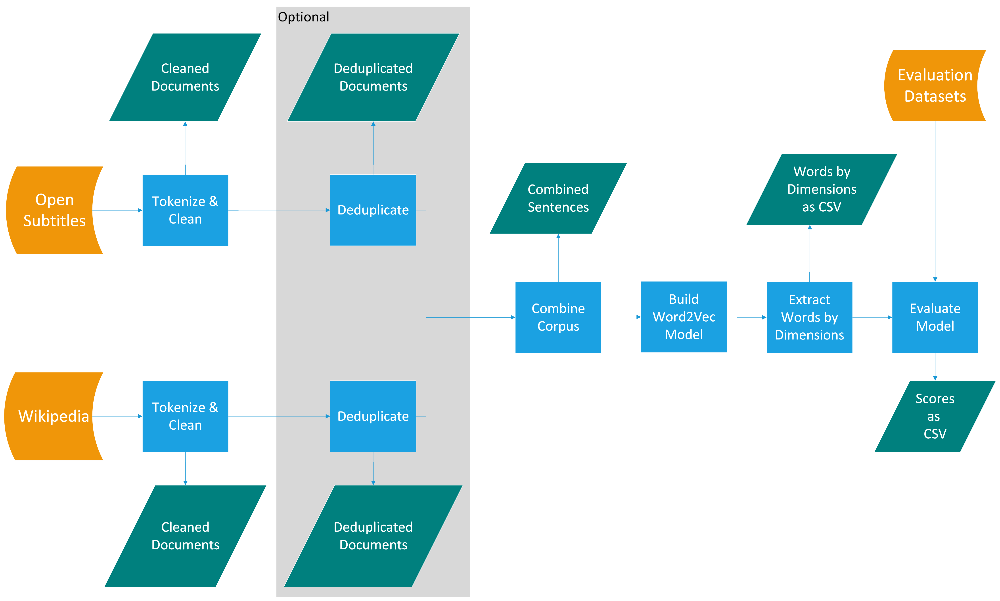

# Python Scripts: Word2ManyLanguages

This folder contains the Python code and workflow documentation used in the **Word2ManyLanguages** project to build and evaluate word embeddings across 59 languages.

## 📂 Contents

- `word2manylanguages.py` — Main script containing the functions used to write the walk through
- `word2manylanguages_workflow.ipynb` — A walk-through notebook version for replication, which contains the following:

  - Corpus processing (Wikipedia & OpenSubtitles)
  - Model training (fastText via Gensim)
  - Norm prediction evaluation using regression

- `word2manylanguages_process.png` — Visual overview of the workflow (see below).

## 🔁 Reproducible Workflow

The script trains models with varying:

- Dimensions (50–500)
- Window sizes (1–6)
- Algorithms: `cbow` and `skipgram`

and evaluates their ability to predict psycholinguistic norms such as valence, age of acquisition, and concreteness.

## 📊 Workflow Diagram

This figure illustrates the full data flow: from raw corpora → model training → evaluation.

## 📦 Requirements

- Python 3.10+
- `gensim==3.8.3`
- `numpy`, `pandas`, `scikit-learn`